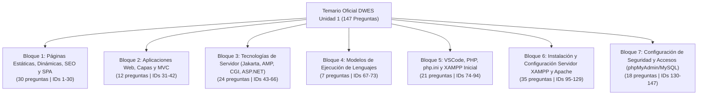

# 🗺️ Mapeado Integral del Proyecto: DWES Test Master
### Unidad 1: Arquitecturas Web y Entornos de Desarrollo (FP DAW / DAM)
**Codificación Oficial**: `UTF-8` estricto (100% compatible con vocales acentuadas: á, é, í, ó, ú, Á, É, Í, Ó, Ú, eñes: ñ, Ñ, y signos: ¿, ¡)  
**Total de Preguntas Oficiales**: 147 preguntas verificadas línea por línea  
**Fecha de Registro y Auditoría**: Octubre 2026  

---

## 📌 1. Resumen Ejecutivo del Proyecto

**DWES Test Master** es una plataforma web interactiva de entrenamiento, autoevaluación y preparación exhaustiva para el examen oficial del módulo profesional **Desarrollo Web en Entorno Servidor (DWES)**, perteneciente a los ciclos formativos de grado superior:
- **DAW**: Desarrollo de Aplicaciones Web
- **DAM**: Desarrollo de Aplicaciones Multiplataforma

### Objetivos Clave:
1. **Rigor Curricular 100% Oficial**: Cubre cada definición, directiva, tabla, ruta de ficheros, comando de terminal y nota al pie de página de los tres documentos oficiales de la unidad.
2. **Fórmula Oficial FP Eliminatoria**: Aplica el estándar de calificación de las pruebas teóricas oficiales:
   $$\text{Nota} = \max\left(0, \frac{\text{Aciertos} - \frac{\text{Fallos}}{3}}{\text{Total}} \times 10\right)$$
3. **Cero Dependencias (Vanilla Web)**: Funciona sin necesidad de Node.js, npm, servidores de base de datos ni compiladores. Se abre con doble clic directamente en el navegador (`file:///`) o bajo Apache (`http://localhost/`).
4. **PWA Offline**: Opera sin conexión mediante Service Worker e instalación como aplicación de escritorio o móvil.

---

## 📂 2. Inventario y Mapeado de Ficheros del Repositorio

El proyecto está organizado en una arquitectura desacoplada, clara y modular:

```text
c:\Users\usuario\Desktop\ant\examenPHP/
│
├── 📄 index.html                      # Estructura semántica HTML5, vistas de la SPA, modales y accesibilidad
├── 🎨 styles.css                      # Sistema de diseño, tokens CSS, modo oscuro/claro, animaciones y responsive
├── ⚙️ app.js                          # Controlador principal (DWESExamApp), lógica de examen, audio y persistencia
├── 📚 questions.js                    # Banco de datos oficial con las 147 preguntas exhaustivas (UTF-8)
├── ⚡ sw.js                           # Service Worker PWA (Caché v4 con estrategia Cache-First)
├── 📱 manifest.json                   # Manifiesto de PWA para instalación en móviles y PC
│
├── 📖 README.md                       # Documentación general del repositorio y guía de usuario
├── 🗺️ MAPA_PROYECTO.md                # Este documento: registro maestro de arquitectura, temas y codificación
├── 📝 PROMPT_AMPLIACION_XAMPP.md      # Especificación y diseño pedagógico de la ampliación de preguntas 95-147
├── 📑 pdf.md                          # Síntesis estructurada del PDF 1 (Arquitecturas Web - 20 páginas)
├── 📑 pdf2.md                         # Síntesis estructurada del PDF 2 (Instalación y Configuración XAMPP)
├── 📑 pdf3.md                         # Síntesis estructurada del PDF 3 (Configuración de Accesos y Seguridad)
│
├── 📕 1_1_DWES_ArquitecturasWeb.pdf   # Documento oficial fuente 1 (Teoría de Arquitecturas Web)
├── 📕 Configuracion_XAMPP_inicial.pdf # Documento oficial fuente 2 (Entorno XAMPP y Apache)
└── 📕 ConfigurarAccesos.pdf           # Documento oficial fuente 3 (Seguridad, MySQL y phpMyAdmin)
```

### Detalle Técnico por Fichero:

| Fichero | Formato / Lenguaje | Codificación | Propósito Principal |
| :--- | :--- | :--- | :--- |
| **`index.html`** | HTML5 Semántico | UTF-8 | Define el encabezado, filtros temáticos por bloque y nivel, panel de estadísticas en tiempo real, tarjeta de preguntas, modal de revisión post-examen, modal de mapa 1-147, visor de flashcards 3D, consola terminal CLI interactiva y chuletas del temario. |
| **`styles.css`** | CSS3 (Variables nativas) | UTF-8 | Sistema de temas oscuro (`#0b0f19`) y claro (`#f8fafc`), efectos de *glassmorphism*, diseño responsive adaptable a móviles y tablets, animaciones de retroalimentación (éxito, fallo, giro de tarjetas 3D). |
| **`app.js`** | JavaScript (ES6+ Vanilla) | UTF-8 | Implementa la clase controladora `DWESExamApp`. Gestiona estados de examen, cronómetro regresivo, sintetizador de audio procedimental (`Web Audio API`), persistencia en `localStorage`, atajos de teclado y el simulador de consola CLI interactivo. |
| **`questions.js`** | JavaScript (Objeto de datos) | UTF-8 | Array constante `QUESTIONS_DATA` con las 147 preguntas estructuradas con justificación oficial, 3 distractores explicados y notas de trampa de examen. |
| **`sw.js`** | Service Worker JS | UTF-8 | Proporciona capacidades PWA sin conexión (`Cache-First`), almacenamiento en caché de activos y ciclo de vida de actualización inmediata (`skipWaiting()`, `clients.claim()`). Versión actual: `dwes-simulador-v4`. |
| **`manifest.json`** | JSON | UTF-8 | Configuración PWA para instalación con icono SVG vectorial corporativo de PHP, orientación preferente y color de tema. |

---

## 🗂️ 3. Mapeado de los 7 Bloques Temáticos Oficiales

El temario oficial se desglosa en **7 bloques**, totalizando **147 preguntas**:



---

### 📘 Bloque 1: Páginas Estáticas, Dinámicas, SEO y SPA (Páginas 1 a 8)
* **Preguntas**: 30 (IDs: `1` al `30`)
* **Documento Fuente**: [1_1_DWES_ArquitecturasWeb.pdf](file:///c:/Users/usuario/Desktop/ant/examenPHP/1_1_DWES_ArquitecturasWeb.pdf)
* **Conceptos Evaluados**:
  - Distinción entre lenguaje de marcas (HTML/XHTML para estructura) y hojas de estilo (CSS para presentación visual).
  - Esquema secuencial de **4 pasos** de petición estática (1. Solicitud cliente $\rightarrow$ 2. Búsqueda en almacén $\rightarrow$ 3. Recuperación $\rightarrow$ 4. Envío al navegador).
  - Parámetros que condicionan las páginas dinámicas (navegador cliente, usuario autenticado, acciones previas).
  - Páginas dinámicas en cliente (JavaScript, manipulación de DOM, validación) frente a dinámicas en servidor (`.php`, `.asp`, `.jsp`, `.cgi`, `.aspx`).
  - Esquema de **6 pasos** del ciclo dinámico de servidor (ejemplo del webmail: petición, comprobación de sesión, consulta a base de datos, maquetación HTML en caliente y envío).
  - Indexación por motores de búsqueda (**Googlebot**) y ventaja del contenido estático para posicionamiento SEO.
  - Navegación estática local mediante protocolo `file:///` desde soportes extraíbles (memorias USB, DVD) sin servidor web.
  - Primera generación web (documentos de solo lectura) frente a segunda generación web (interacción, colaboración, redes sociales).
  - **Aplicaciones Web**: ventajosas por centralización de datos y multiplataforma; desventajas en dependencia de red y menor aprovechamiento del hardware directo (3D, aceleración GPU).
  - **PWA (Progressive Web Apps)**: comportamiento similar a apps nativas, soporte offline y notificaciones *push*.
  - Gestores de Contenidos (**CMS**): WordPress, Joomla!, Drupal. Separación entre *Front-end* (usuarios/visitantes) y *Back-end* (administradores y redactores).
  - Arquitectura **SPA (Single Page Application)**: carga inicial única de contenedor, peticiones asíncronas vía AJAX/Fetch a servicios web REST, intercambio ligero en formato **JSON** y renderizado dinámico en cliente.

---

### 📙 Bloque 2: Aplicaciones Web, Arquitectura en Capas y Patrón MVC (Páginas 8 a 10)
* **Preguntas**: 12 (IDs: `31` al `42`)
* **Documento Fuente**: [1_1_DWES_ArquitecturasWeb.pdf](file:///c:/Users/usuario/Desktop/ant/examenPHP/1_1_DWES_ArquitecturasWeb.pdf)
* **Conceptos Evaluados**:
  - Los **4 componentes de ejecución** de una aplicación web: Servidor Web, Módulo Ejecutor de scripts, Servidor de Base de Datos y Lenguaje de programación.
  - Razón de ser de la arquitectura por capas: modularidad, escalabilidad y posibilidad de desplegar cada capa en servidores físicos o contenedores independientes.
  - **Arquitectura de 3 Capas**:
    - **Capa de Presentación**: Interfaz de usuario que se ejecuta en el navegador (HTML, CSS, JavaScript).
    - **Capa de Lógica de Negocio (Servidor de Aplicaciones)**: Procesamiento de reglas de negocio (PHP, Java, Python, .NET).
    - **Capa de Datos**: Almacenamiento persistente e integridad de la información (MySQL, PostgreSQL, Oracle, MongoDB).
  - **Patrón Arquitectónico Modelo-Vista-Controlador (MVC)**:
    - **Modelo**: Representa los datos del sistema, las entidades y las reglas de negocio.
    - **Vista**: Presenta la información al usuario en un formato visual apropiado.
    - **Controlador**: Intermediario que intercepta las peticiones del usuario, invoca las operaciones del modelo y selecciona la vista que devolverá la respuesta.
  - Diagrama de secuencia formal de peticiones MVC: `Petición HTTP` $\rightarrow$ `Controlador` $\rightarrow$ `Consulta al Modelo` $\rightarrow$ `Datos devueltos al Controlador` $\rightarrow$ `Envío a la Vista` $\rightarrow$ `Renderizado final`.

---

### 📗 Bloque 3: Tecnologías y Plataformas de Servidor (Páginas 10 a 15)
* **Preguntas**: 24 (IDs: `43` al `66`)
* **Documento Fuente**: [1_1_DWES_ArquitecturasWeb.pdf](file:///c:/Users/usuario/Desktop/ant/examenPHP/1_1_DWES_ArquitecturasWeb.pdf)
* **Conceptos Evaluados**:
  - **Jakarta EE (antigua Java EE / J2EE)**: Estándar empresarial gestionado por la Fundación Eclipse con respaldo de Oracle, IBM y Red Hat.
  - Componentes de Jakarta EE: Servlets y páginas JSP (capa web) frente a Enterprise JavaBeans (**EJB**) para lógica de negocio distribuida y transaccional.
  - Servidores de aplicaciones completos (WebSphere, WebLogic, JBoss EAP/WildFly, GlassFish, Apache Geronimo [proyecto descontinuado]) frente a contenedores de Servlets ligeros (Apache Tomcat, Jetty).
  - **Pila AMP**: Acrónimo oficial formado por Apache, MySQL/MariaDB y PHP/Perl/Python. Variantes regionales según el sistema operativo (LAMP en Linux, WAMP en Windows, MAMP en macOS) y soporte opcional de PostgreSQL.
  - Significado exacto del acrónimo **XAMPP**: **X** (Multiplataforma), **A** (Apache), **M** (MySQL/MariaDB), **P** (PHP), **P** (Perl). Proyecto hospedado en `apachefriends.org`.
  - **CGI (Common Gateway Interface)**: Estándar clásico independiente del lenguaje (C, C++, Perl, Python). Inconveniente crítico de arquitectura: **creación de un proceso nuevo del sistema operativo por cada petición HTTP**, provocando alto consumo de memoria y saturación del servidor.
  - Mecanismos de superación del cuello de botella de CGI: **FastCGI** (procesos persistentes reutilizables) y módulos integrados en el propio servidor web (`mod_php`, `mod_perl`, PHP-FPM).
  - **ASP.NET Core**: Plataforma de Microsoft, multiplataforma, lenguaje C#, soporte para IIS en Windows y servidores Kestrel en Linux.
  - **Node.js**: Entorno de ejecución de JavaScript en el lado del servidor basado en el motor V8 de Google, con frameworks como Express.js y NestJS.
  - Criterios objetivos para la elección de una arquitectura de servidor (coste de licencias, curva de aprendizaje, ecosistema de librerías, requisitos de escalabilidad).
  - Integración de Python en servidores web: obsolescencia de `mod_python` y adopción del estándar moderno **WSGI (Web Server Gateway Interface)** combinado con servidores proxy inversos como Nginx o Apache.

---

### 📕 Bloque 4: Modelos de Ejecución de Lenguajes de Servidor (Páginas 15 a 16)
* **Preguntas**: 7 (IDs: `67` al `73`)
* **Documento Fuente**: [1_1_DWES_ArquitecturasWeb.pdf](file:///c:/Users/usuario/Desktop/ant/examenPHP/1_1_DWES_ArquitecturasWeb.pdf)
* **Conceptos Evaluados**:
  - **Lenguajes Interpretados (Scripting)**: Código fuente en texto plano interpretado línea por línea en tiempo de ejecución (PHP, Python, Ruby). Gran portabilidad e inmediatez en el desarrollo frente a menor rendimiento bruto.
  - **Lenguajes Compilados a Código Máquina**: Compilación previa directa a binario ejecutable específico de la CPU (C, C++, Go, Rust). Máxima velocidad de ejecución pero dependencia de la plataforma y mayor complejidad de despliegue.
  - **Lenguajes Compilados a Código Intermedio (Bytecode)**: Compilación a bytecode agnóstico (Java con JVM, C# con .NET CLR), optimizado dinámicamente en caliente mediante compiladores **JIT (Just-In-Time)**.
  - **Código Embebido en HTML**: Capacidad de insertar scripts de servidor dentro del marcado cliente mediante etiquetas delimitadoras (`<?php ... ?>`), permitiendo generar partes dinámicas sin alterar la estructura fija (ejemplo con `$_SERVER['SERVER_NAME']`).

---

### 📓 Bloque 5: Entorno VSCode, PHP, php.ini y XAMPP Inicial (Páginas 16 a 20)
* **Preguntas**: 21 (IDs: `74` al `94`)
* **Documento Fuente**: [1_1_DWES_ArquitecturasWeb.pdf](file:///c:/Users/usuario/Desktop/ant/examenPHP/1_1_DWES_ArquitecturasWeb.pdf)
* **Conceptos Evaluados**:
  - Entornos de Desarrollo Integrado (**IDE**): Eclipse, NetBeans, PhpStorm (comercial de JetBrains) y Visual Studio Code (gratuito y extensible).
  - Extensiones recomendadas en el currículo para VSCode: `PHP Intelephense` (autocompletado, estándares PSR-12, anotaciones), `PHP Code Sniffer`, `Code Runner` (ejecución directa en terminal) y `Laravel Snippets`.
  - Fundamentos de PHP: Sintaxis heredada de C y Java, versión recomendada PHP 8.x (> 7.0), ecosistema de frameworks (Laravel, Symfony, CodeIgniter).
  - Delimitadores `<?php` y `?>`. **Buena práctica oficial: omitir la etiqueta de cierre `?>` en ficheros que contengan exclusivamente código PHP puro** para evitar envíos involuntarios de espacios en blanco en las cabeceras HTTP.
  - Directivas fundamentales de configuración en `php.ini`:
    - `short_open_tag = Off` (obligatorio para evitar conflictos con la etiqueta de apertura XML `<?xml ... ?>`).
    - `max_execution_time`: Límite máximo en segundos que un script puede ejecutarse antes de que el motor lo interrumpa (por defecto 30 segundos).
    - `error_reporting = E_ALL & ~E_NOTICE`: Configuración de reporte de errores mediante operadores a nivel de bits (el operador virgulilla `~` niega la máscara de bits).
    - `file_uploads = On` y `upload_max_filesize` (tamaño máximo de ficheros subidos por formulario).
  - Fichero de configuración principal de PHP: ruta `C:\xampp\php\php.ini` y función de inspección diagnóstica `phpinfo()`.
  - Directorio raíz de publicación (**DocumentRoot**): `C:\xampp\htdocs`.
  - Rol de `index.php` como archivo índice por defecto y fenómeno del **Listado de directorios (*Directory Listing*)** cuando este fichero no existe o ha sido renombrado.
  - Comprobación de instalación inicial mediante `http://localhost` (pantalla de bienvenida de XAMPP).
  - Estructura básica del primer script de prueba `holamundo.php`.

---

### 📔 Bloque 6: Instalación y Configuración del Servidor XAMPP y Apache (PDF 2)
* **Preguntas**: 35 (IDs: `95` al `129`)
* **Documento Fuente**: [Configuracion_XAMPP_inicial.pdf](file:///c:/Users/usuario/Desktop/ant/examenPHP/Configuracion_XAMPP_inicial.pdf)
* **Conceptos Evaluados**:
  - Definición y propósito de XAMPP para desarrolladores principiantes: entorno preconfigurado "extraer y listo" para trabajar en local sin conexión a Internet.
  - Diferencia crítica entre sistemas de archivos: **Linux distingue mayúsculas de minúsculas (*case-sensitive*)** en rutas y ficheros, mientras que **Windows es insensible a las mayúsculas (*case-insensitive*)**.
  - Componentes auxiliares incluidos en el paquete: Mercury Mail (servidor de correo SMTP/POP3), phpMyAdmin (gestor web de MySQL), Webalizer (analizador estadístico de logs de Apache), Apache Tomcat (servidor de Servlets/JSP en Java) y FileZilla Server (servidor de transferencia FTP).
  - Instalación en Windows: Alertas del Firewall (autorizar redes privadas y desmarcar redes públicas) y necesidad de ejecutar el Panel de Control de XAMPP con **permisos de Administrador** para instalar servicios persistentes de Windows.
  - Puertos de red por defecto: Apache en el puerto `80` (HTTP) y `443` (HTTPS/SSL); MySQL en el puerto `3306`.
  - Resolución de loopback: diferencias y similitudes entre la dirección IP local `127.0.0.1` y el nombre de host `localhost`.
  - Estructura y comportamiento de `DocumentRoot` en `C:\xampp\htdocs`.
  - Procedimiento obligatorio para editar la configuración de Apache: **detener primero el servicio (Stop)**, modificar el fichero y reiniciarlo (Start) para que recargue la configuración en memoria.
  - Localización de ficheros de Apache: `C:\xampp\apache\conf\httpd.conf` (sintaxis de comentarios con almohadilla `#`).
  - Resolución de conflictos de puertos en Windows 10 (ej. servicios de Skype, IIS o World Wide Web Publishing Service ocupando el puerto 80) modificando la directiva `Listen` a `Listen 8080`.
  - Creación de alias de directorios en `C:\xampp\apache\conf\extra\httpd-xampp.conf`: sintaxis `Alias /nombre_url "C:/ruta_carpeta"`.
  - Directivas de seguridad y permisos en bloques `<Directory>`:
    - `Options Indexes`: Permite listar archivos si no hay archivo de índice (si se desactiva muestra error `403 Forbidden`).
    - `Options FollowSymLinks`: Permite al servidor seguir enlaces simbólicos del sistema operativo.
    - `Options MultiViews`: Activa la negociación automática de contenidos según las cabeceras HTTP del cliente.
    - `AllowOverride All` frente a `AllowOverride None`: Controla si las directivas pueden ser sobrescritas por ficheros `.htaccess` locales.
    - `Require all granted`: Permite el acceso sin restricciones a cualquier cliente.
    - `Require all denied`: Deniega completamente el acceso a los recursos de la carpeta.
  - Parámetros en `php.ini` (sintaxis de comentarios con punto y coma `;`): `display_errors = On` (recomendado para entorno de desarrollo) frente a `display_errors = Off` (obligatorio en producción para evitar fugas de información sensible).
  - Política de credenciales de MySQL en desarrollo local inicial: conservar el usuario `root` sin contraseña para no romper la conexión predeterminada de phpMyAdmin.

---

### 📓 Bloque 7: Configuración de Seguridad y Accesos a phpMyAdmin y MySQL (PDF 3)
* **Preguntas**: 18 (IDs: `130` al `147`)
* **Documento Fuente**: [ConfigurarAccesos.pdf](file:///c:/Users/usuario/Desktop/ant/examenPHP/ConfigurarAccesos.pdf)
* **Conceptos Evaluados**:
  - Modelo de acceso inicial por defecto en phpMyAdmin bajo XAMPP: autenticación tipo `config` sin solicitud de usuario ni clave, diseñada para facilitar el aprendizaje inicial en local.
  - Fichero de configuración de autenticación de phpMyAdmin: `C:\xampp\phpMyAdmin\config.inc.php`.
  - Configuración del formulario de login web interactivo: cambio de la directiva a `$cfg['Servers'][$i]['auth_type'] = 'cookie';`.
  - Bloqueo estricto de accesos vacíos: directiva `$cfg['Servers'][$i]['AllowNoPassword'] = false;` (deniega el acceso a usuarios que no posean clave configurada).
  - Comandos de consola `mysqladmin` (ubicados en `C:\xampp\mysql\bin` o accesibles mediante el botón *Shell* del Panel de XAMPP):
    - **Asignación inicial** (cuando el usuario `root` NO tiene contraseña previa):
      ```bash
      mysqladmin -u root password mi_clave_secreta
      ```
    - **Modificación posterior** (cuando el usuario `root` YA tiene contraseña establecida):
      ```bash
      mysqladmin -u root -p password nueva_clave
      ```
      *(El flag `-p` es indispensable para que el sistema solicite la clave actual antes de aceptar la nueva).*
  - Apertura del acceso a phpMyAdmin a través de la Red Local (LAN):
    - Localización en `httpd-xampp.conf` dentro del bloque `<Directory "C:/xampp/phpMyAdmin">`.
    - Sustitución de la restricción local `Require local` por la directiva permisiva `Require all granted`.
    - Reinicio preceptivo del servicio Apache para aplicar las directivas de control de acceso.

---

## 🎮 4. Mapeado de Modos de Estudio y Funcionalidades del Simulador

| Modo de Estudio | Icono | Descripción Operativa |
| :--- | :---: | :--- |
| **Modo Tutor** | 🎓 | Modo de estudio pregunta a pregunta con retroalimentación instantánea. Muestra la justificación académica oficial del PDF, desglose minucioso de por qué cada distractor es falso y recuadro de aviso con *"Ojo a la trampa de examen"*. |
| **Simulacro Oficial** | ⏱️ | Simulación rigurosa con selector de tiempo (Express 15m, Estándar 25m, Maratón 60m con las 147 preguntas). Selección neutral sin delatar aciertos ni fallos en vivo. Permite dejar en blanco o rectificar respuestas. Aplica penalización eliminatoria oficial ($-0.33$ por fallo) y genera diagnóstico post-examen detallado por bloques con filtro de errores. |
| **Preguntas Trampa** | ⚠️ | Filtro dinámico enfocado en las 37 preguntas de nivel avanzado (WSGI, directivas binarias de `php.ini`, sintaxis de flags en `mysqladmin`, diferencias de mayúsculas en Linux y opciones de `<Directory>`). |
| **Bolsa de Fallos** | 🔁 | Sistema de reentrenamiento que almacena en `localStorage` las preguntas falladas en cualquier modo hasta que el alumno las responde con éxito. |
| **Guardar Duda (Favoritas)** | ⭐ | Marcador rápido para almacenar preguntas dudosas y repasarlas específicamente antes de la prueba. |
| **Flashcards 3D** | 🎴 | Baraja de 25 tarjetas interactivas de memorización rápida con efecto de volteo 3D para consolidar acrónimos, directivas, rutas y puertos oficiales. Permite clasificar en *"Me lo sé"* o *"Repasar"*. |
| **Muerte Súbita** | ⚡ | Modo de alta intensidad: 15 segundos por pregunta con barra temporal regresiva. Un solo error finaliza la partida y registra el récord en el navegador. |
| **Terminal CLI Simulada** | 💻 | Emulador de consola interactiva con comandos reales del temario (`mysqladmin -u root password`, creación de `Alias`, directivas `Require`). Valida sintaxis y ofrece corrección pedagógica en vivo. |
| **Chuletas del Tema** | 📖 | 7 tablas de consulta rápida con directivas de `php.ini`, acrónimos de arquitectura, directivas de Apache, autenticación en phpMyAdmin y comandos CLI. |
| **Mapa de Preguntas** | 🗺️ | Panel en cuadrícula (1 a 147) para saltar directamente a cualquier pregunta con código de colores (verde: respondida, azul: actual, amarillo: con duda, gris: pendiente). |

---

## 🔤 5. Política y Garantía de Codificación de Caracteres (UTF-8)

Para garantizar la correcta representación de todas las particularidades ortográficas del idioma español (tildes agudas, diéresis, eñes y signos de puntuación dobles), el proyecto implementa un estándar unificado:

### Reglas Técnicas Aplicadas:
1. **Encabezado HTML**:
   ```html
   <meta charset="UTF-8">
   ```
2. **Carga Explícita de Scripts en HTML**:
   ```html
   <script src="questions.js" charset="UTF-8"></script>
   <script src="app.js" charset="UTF-8"></script>
   ```
3. **Ficheros Fuente**:
   - Tanto `questions.js`, `app.js`, `index.html` como `styles.css` están guardados en formato **UTF-8 sin BOM**.
4. **Service Worker v4**:
   - Se ha configurado `CACHE_NAME = 'dwes-simulador-v4'` en [sw.js](file:///c:/Users/usuario/Desktop/ant/examenPHP/sw.js) para forzar la invalidación inmediata de la caché antigua del navegador y servir el banco de preguntas con codificación corregida.

### Tabla de Compatibilidad Verificada:

| Carácter | Nombre / Función | Secuencia UTF-8 | Visualización Verificada |
| :---: | :--- | :---: | :---: |
| **á** | Vocal a con tilde | `0xC3 0xA1` | ✅ Correcto (`página`, `estática`) |
| **é** | Vocal e con tilde | `0xC3 0xA9` | ✅ Correcto (`¿Qué`, `almacén`) |
| **í** | Vocal i con tilde | `0xC3 0xAD` | ✅ Correcto (`línea`, `envía`) |
| **ó** | Vocal o con tilde | `0xC3 0xB3` | ✅ Correcto (`código`, `petición`) |
| **ú** | Vocal u con tilde | `0xC3 0xBA` | ✅ Correcto (`según`, `módulo`) |
| **Á** | Vocal A mayúscula con tilde | `0xC3 0x81` | ✅ Correcto |
| **É** | Vocal E mayúscula con tilde | `0xC3 0x89` | ✅ Correcto |
| **Í** | Vocal I mayúscula con tilde | `0xC3 0x8D` | ✅ Correcto |
| **Ó** | Vocal O mayúscula con tilde | `0xC3 0x93` | ✅ Correcto (`PATRÓN`) |
| **Ú** | Vocal U mayúscula con tilde | `0xC3 0x9A` | ✅ Correcto (`ÚLTIMO`) |
| **ñ** | Eñe minúscula | `0xC3 0xB1` | ✅ Correcto (`diseño`, `tamaño`) |
| **Ñ** | Eñe mayúscula | `0xC3 0x91` | ✅ Correcto (`AÑADIR`) |
| **¿** | Signo de apertura de interrogación | `0xC2 0xBF` | ✅ Correcto (`¿Qué ocurre...?`) |
| **¡** | Signo de apertura de exclamación | `0xC2 0xA1` | ✅ Correcto (`¡Atención!`) |

---

## ⌨️ 6. Atajos de Teclado del Simulador

| Atajo de Teclado | Acción |
| :---: | :--- |
| <kbd>1</kbd> o <kbd>A</kbd> | Seleccionar la opción **A** |
| <kbd>2</kbd> o <kbd>B</kbd> | Seleccionar la opción **B** |
| <kbd>3</kbd> o <kbd>C</kbd> | Seleccionar la opción **C** |
| <kbd>4</kbd> o <kbd>D</kbd> | Seleccionar la opción **D** |
| <kbd>→</kbd> o <kbd>Enter</kbd> | Avanzar a la siguiente pregunta |
| <kbd>←</kbd> | Retroceder a la pregunta anterior |
| <kbd>M</kbd> | Abrir o cerrar el Mapa Interactivo de Preguntas (1 a 147) |
| <kbd>D</kbd> | Marcar o desmarcar la pregunta actual con estrella de duda (⭐) |
| <kbd>Escape</kbd> | Cerrar cualquier ventana modal activa |

---

## 🚀 7. Modos de Ejecución Soportados

1. **Apertura Directa (Protocolo `file:///`)**:
   - Basta con hacer doble clic en `index.html`.
   - Compatible con Google Chrome, Mozilla Firefox, Microsoft Edge, Brave y Opera.
2. **Servidor Local Apache (XAMPP)**:
   - Copiar la carpeta en `C:\xampp\htdocs\examenPHP`.
   - Iniciar Apache en el panel de XAMPP.
   - Navegar a `http://localhost/examenPHP/`.
3. **Instalación como PWA**:
   - Abrir en el navegador y pulsar sobre el icono de instalación en la barra de direcciones (*"Instalar DWES Test Master"*).
   - Funciona como una app de escritorio independiente y con acceso sin conexión.
